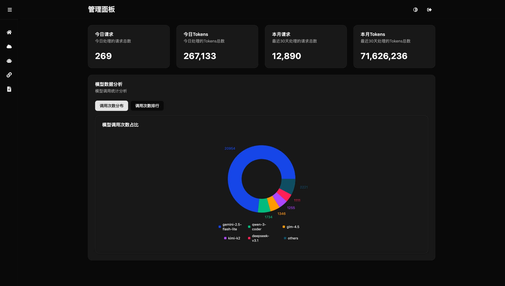
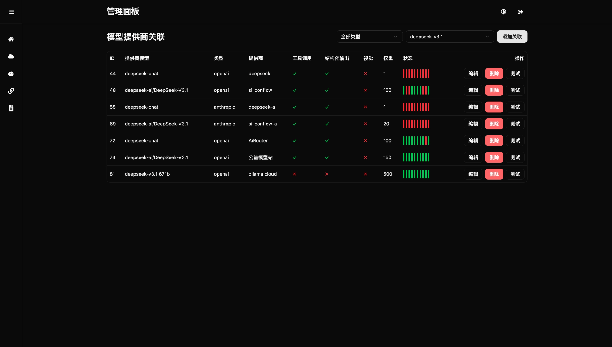

# LLMIO

LLMIO 是一个基于 Golang 的项目，提供统一的 API 来与各种大语言模型（LLM）进行交互。它支持在不同提供商之间进行智能负载均衡，并高效地处理请求。该服务还提供了一个现代化的 Web UI 界面，方便用户管理和监控系统。

## 功能特性

### 核心功能
- **统一 API 访问**：通过单一 API 接入多种 LLM 提供商（如 OpenAI、Anthropic）
- **智能负载均衡**：支持带权重的随机选择和基于工具调用/结构化输出/多模态/权重/限流的智能路由
- **流式和非流式响应**：同时支持流式和标准响应模式
- **速率限制处理**：自动处理提供商的速率限制
- **使用情况跟踪**：详细的日志记录和使用情况统计

### 用户体验功能 🆕
- **🏥 提供商健康监控**：实时检测提供商状态（healthy/degraded/unhealthy）
- **📊 增强仪表板**：24小时完整统计和1小时实时数据
- **🔄 批量操作**：支持批量删除提供商和模型
- **✅ 配置验证**：添加提供商前验证配置有效性
- **📥 数据导出**：导出日志（CSV）和配置（JSON）

### 管理界面
- **Web 管理界面**：直观的 Web UI 用于管理提供商、模型和监控系统
- **系统监控**：实时查看请求统计、模型使用情况和请求日志
- **提供商连通性测试**：内置测试功能验证提供商连接

## 主页


## 多对一关联


## 部署

### Docker

使用提供的 Dockerfile 构建镜像：

```bash
docker build -t llmio .
docker run -p 7070:7070 -e TOKEN=your-token llmio
```

### Docker Compose

```yml
services:
  llmio:
    image: atopos31/llmio:latest
    ports:
      - 7070:7070
    volumes:
      - ./db:/app/db
    environment:
      - GIN_MODE=release
      - TOKEN=<YOUR_TOKEN>
      - TZ=Asia/Shanghai
```

```bash
docker compose up -d
```

## 开发

### 先决条件

- Go 1.25.0+
- Node.js 20+ (用于构建 Web UI)

### 安装

1. 克隆仓库：
   ```bash
   git clone https://github.com/atopos31/llmio.git
   cd llmio
   ```

2. 安装后端依赖：
   ```bash
   go mod tidy
   ```

3. 初始化数据库：
   ```bash
   mkdir db
   go run main.go
   ```
   这将自动创建一个 SQLite 数据库文件（`db/llmio.db`）并初始化数据库结构。

4. 构建前端界面：
   ```bash
   cd webui
   npm install
   npm run build
   cd ..
   ```
   
   前端使用 React 19 + TypeScript + Vite + Tailwind CSS 构建，支持现代化的响应式设计。

### 配置

该服务使用数据库来存储提供商和模型的配置。你可以通过 Web UI 或直接操作数据库来添加提供商和模型。

#### 环境变量

- `TOKEN`: API 访问令牌（可选，但推荐设置）
- `TZ`: 时区设置（可选，默认为 UTC）

#### 提供商配置示例：

**OpenAI 提供商：**
- 名称: openai
- 类型: openai
- 配置: `{"base_url": "https://api.openai.com/v1", "api_key": "your-api-key"}`

**Anthropic 提供商：**
- 名称: anthropic
- 类型: anthropic
- 配置: `{"base_url": "https://api.anthropic.com/v1", "api_key": "your-api-key", "version": "2023-06-01"}`

#### 模型配置示例：
- 名称: gpt-3.5-turbo
- 备注: OpenAI 的 GPT-3.5 Turbo 模型
- 名称: claude-3-haiku-20240307
- 备注: Anthropic 的 Claude 3 Haiku 模型

### 运行服务

启动服务：
```bash
go run main.go
```

服务将在 `http://localhost:7070` 可用。
- API 端点: `http://localhost:7070/v1/`
- 管理界面: `http://localhost:7070/`

## Web 管理界面

LLMIO 提供了一个现代化的 Web 管理界面，包含以下功能：

1. **系统概览**：实时显示系统指标，如请求次数、Token 使用情况和模型调用统计
2. **提供商管理**：添加、编辑和删除 LLM 提供商
3. **模型管理**：管理可用的模型
4. **模型提供商关联**：关联模型与提供商，并设置权重
5. **请求日志**：查看详细请求日志，支持筛选和分页

访问 `http://localhost:7070/` 来使用 Web 管理界面。

## API 端点

### 聊天补全

POST `/v1/chat/completions`

请求体遵循 OpenAI 聊天补全 API 格式。

示例：
```json
{
  "model": "gpt-3.5-turbo",
  "messages": [
    {
      "role": "user",
      "content": "Hello!"
    }
  ],
  "stream": true
}
```

### Anthropic Messages

POST `/v1/messages`

请求体遵循 Anthropic Messages API 格式，用于与 Claude 模型交互。

示例：
```json
{
  "model": "claude-3-haiku-20240307",
  "max_tokens": 1024,
  "messages": [
    {
      "role": "user",
      "content": "Hello!"
    }
  ]
}
```

### 模型列表

GET `/v1/models`

返回可用模型的列表。

### 管理 API

所有以下端点都需要在请求头中包含 `Authorization: Bearer YOUR_TOKEN`：

#### 提供商管理
- GET `/api/providers` - 获取所有提供商
- GET `/api/providers/template` - 获取提供商配置模板
- GET `/api/providers/models/:id` - 获取提供商支持的模型列表
- POST `/api/providers` - 创建提供商
- POST `/api/providers/validate` - 验证提供商配置 🆕
- POST `/api/providers/batch-delete` - 批量删除提供商 🆕
- PUT `/api/providers/:id` - 更新提供商
- DELETE `/api/providers/:id` - 删除提供商

#### 模型管理
- GET `/api/models` - 获取所有模型
- POST `/api/models` - 创建模型
- POST `/api/models/batch-delete` - 批量删除模型 🆕
- PUT `/api/models/:id` - 更新模型
- DELETE `/api/models/:id` - 删除模型

#### 模型提供商关联
- GET `/api/model-providers` - 获取模型提供商关联
- GET `/api/model-providers/status` - 获取提供商状态信息
- POST `/api/model-providers` - 创建模型提供商关联
- PUT `/api/model-providers/:id` - 更新模型提供商关联
- DELETE `/api/model-providers/:id` - 删除模型提供商关联

#### 健康检查 🆕
- GET `/api/providers/health` - 获取所有提供商健康状态
- GET `/api/providers/health/:id` - 获取单个提供商健康状态

#### 仪表板和统计 🆕
- GET `/api/dashboard/stats` - 获取24小时仪表板统计
- GET `/api/dashboard/realtime` - 获取1小时实时统计
- GET `/api/metrics/use/:days` - 获取使用指标
- GET `/api/metrics/counts` - 获取模型计数统计

#### 日志和导出 🆕
- GET `/api/logs` - 获取请求日志（支持分页和筛选）
- GET `/api/logs/export` - 导出日志为CSV格式
- GET `/api/config/export` - 导出配置为JSON格式

#### 系统配置
- GET `/api/config` - 获取系统配置
- PUT `/api/config` - 更新系统配置

#### 测试工具
- GET `/api/test/:id` - 提供商连通性测试
- GET `/api/test/react/:id` - 响应式测试

## 架构

该服务由以下组件构成：

- **main.go**: 应用程序入口点
- **handler/**: API 端点的 HTTP 处理器
- **service/**: 聊天补全和负载均衡的业务逻辑
- **providers/**: 不同 LLM 提供商的实现（OpenAI、Anthropic）
- **models/**: 数据库模型和初始化
- **balancer/**: 负载均衡算法
- **common/**: 通用工具和响应助手
- **webui/**: 前端管理界面（React 19 + TypeScript + Vite + Tailwind CSS）
- **middleware/**: 中间件（身份验证等）

## 开发

### 后端开发

```bash
# 创建db目录
mkdir db
go run main.go
```

### 前端开发

```bash
cd webui
npm run dev
```

## 性能优化

项目已进行全面性能优化，详见 [OPTIMIZATION.md](./OPTIMIZATION.md)

主要优化成果：
- 🚀 缓存读取性能提升 5倍
- 📦 Docker镜像体积减小 60%
- 🔒 增强了安全性（非root用户运行）
- 📊 减少日志输出 95%
- ⚡ 并发吞吐量提升 5倍

运行性能测试：
```bash
chmod +x scripts/performance_test.sh
./scripts/performance_test.sh
```

## 用户体验提升功能使用示例 🆕

### 1. 健康检查
```bash
# 检查所有提供商健康状态
curl http://localhost:7070/api/providers/health \
  -H "Authorization: Bearer YOUR_TOKEN"

# 检查特定提供商
curl http://localhost:7070/api/providers/health/1 \
  -H "Authorization: Bearer YOUR_TOKEN"
```

### 2. 仪表板统计
```bash
# 获取24小时统计
curl http://localhost:7070/api/dashboard/stats \
  -H "Authorization: Bearer YOUR_TOKEN"

# 获取实时统计（1小时）
curl http://localhost:7070/api/dashboard/realtime \
  -H "Authorization: Bearer YOUR_TOKEN"
```

### 3. 批量删除
```bash
# 批量删除提供商
curl -X POST http://localhost:7070/api/providers/batch-delete \
  -H "Authorization: Bearer YOUR_TOKEN" \
  -H "Content-Type: application/json" \
  -d '{"ids": [1, 2, 3]}'

# 批量删除模型
curl -X POST http://localhost:7070/api/models/batch-delete \
  -H "Authorization: Bearer YOUR_TOKEN" \
  -H "Content-Type: application/json" \
  -d '{"ids": [1, 2, 3]}'
```

### 4. 配置验证
```bash
# 验证提供商配置
curl -X POST http://localhost:7070/api/providers/validate \
  -H "Authorization: Bearer YOUR_TOKEN" \
  -H "Content-Type: application/json" \
  -d '{
    "name": "Test Provider",
    "type": "openai",
    "config": "{\"base_url\":\"https://api.openai.com/v1\",\"api_key\":\"sk-...\"}",
    "console": "https://platform.openai.com"
  }'
```

### 5. 数据导出
```bash
# 导出最近7天的错误日志
curl http://localhost:7070/api/logs/export?days=7&status=error \
  -H "Authorization: Bearer YOUR_TOKEN" \
  -o logs.csv

# 导出配置
curl http://localhost:7070/api/config/export \
  -H "Authorization: Bearer YOUR_TOKEN" \
  -o config.json
```

详细文档请查看：
- [用户体验提升功能文档](./USER_EXPERIENCE_ENHANCEMENTS.md)
- [功能总结](./FEATURES_SUMMARY.md)
- [性能优化文档](./OPTIMIZATION.md)

## 贡献

欢迎贡献！请提交 issue 或 pull request。

## 许可证

该项目基于 MIT 许可证。